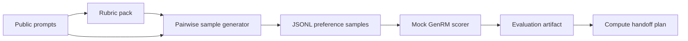

# Writing-Zero First Pass

Zero-spend prototype for the Prime Intellect Writing-Zero bounty proposal.

This repository is a reviewable first milestone, not a final training run. It
defines the data contract, a deterministic pairwise sample generator, a mock
GenRM-style scorer, and a tiny evaluation harness that can run locally before
any paid compute is used.

## Quickstart

```sh
python -m writing_zero_pipeline.cli generate --out artifacts/samples.jsonl
python -m writing_zero_pipeline.cli evaluate --samples artifacts/samples.jsonl --out artifacts/eval.json
python -m unittest discover -s tests
```

## Pipeline



## First Milestone Contract

- Generate pairwise writing samples with stable IDs.
- Preserve prompt, rubric, two candidate answers, label, and provenance.
- Run without network or GPU.
- Produce artifacts that can be inspected before a real GenRM training job.
- Make the future compute handoff explicit: inputs, command shape, metrics, and
  failure modes.

## Next Compute Handoff

Once scope is accepted, replace the mock candidate generator and scorer with:

- LLM-generated candidate responses from agreed models or public datasets.
- Rubric-derived pairwise labels from an agreed evaluator process.
- A real GenRM training entrypoint that consumes the same JSONL schema.
- A main-model training/eval stage that consumes GenRM rewards.

