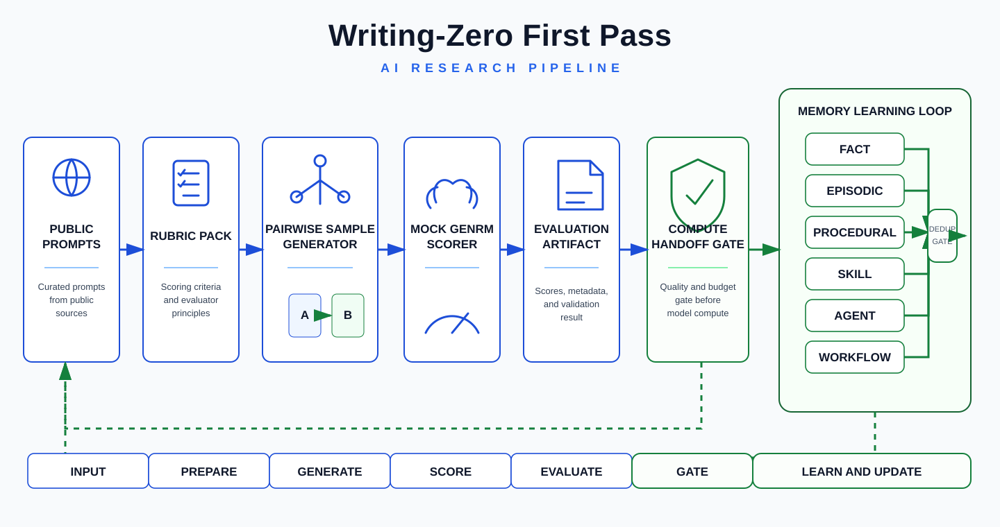
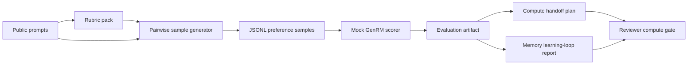
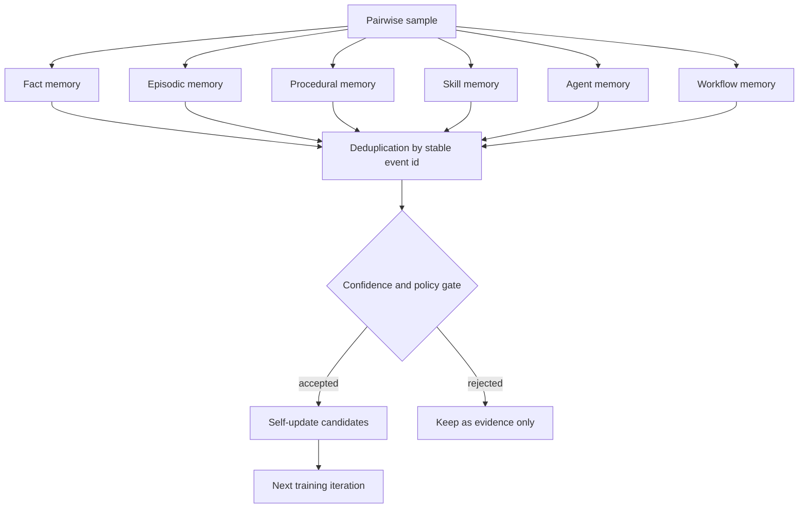

# Writing-Zero First Pass

Zero-spend prototype for the Prime Intellect Writing-Zero bounty proposal.



This repository is a reviewable first milestone, not a final training run. It
defines the data contract, a deterministic pairwise sample generator, a mock
GenRM-style scorer, and a tiny evaluation harness that can run locally before
any paid compute is used.

## Quickstart

```sh
python -m writing_zero_pipeline.cli generate --out artifacts/samples.jsonl
python -m writing_zero_pipeline.cli evaluate --samples artifacts/samples.jsonl --out artifacts/eval.json
python -m writing_zero_pipeline.cli handoff --out artifacts/compute_handoff.json
python -m writing_zero_pipeline.cli learning-loop --samples artifacts/samples.jsonl --out artifacts/learning_loop.json
python -m unittest discover -s tests
```

## Pipeline



## Agent Memory Loop

The prototype now emits a memory-learning artifact that exercises the same
shape expected from a real agent loop: fact memory, episodic memory, procedural
memory, skills, agents, and workflows. It deduplicates stable procedural,
skill, agent, and workflow events across generated samples while preserving
sample-scoped facts and run observations.



## First Milestone Contract

- Generate pairwise writing samples with stable IDs.
- Preserve prompt, rubric, two candidate answers, label, and provenance.
- Run without network or GPU.
- Produce artifacts that can be inspected before a real GenRM training job.
- Make the future compute handoff explicit: inputs, command shape, metrics, and
  failure modes.
- Emit `artifacts/compute_handoff.json` so scope, metrics, and compute gates can
  be reviewed before any real training run.
- Emit `artifacts/learning_loop.json` so memory kinds, deduplication, rejected
  updates, and self-update candidates can be inspected before connecting a real
  agent or model.

## Review Checklist

- `artifacts/samples.jsonl`: deterministic seed samples with stable IDs.
- `artifacts/eval.json`: mock GenRM scorer result for the current seed slice.
- `artifacts/compute_handoff.json`: next-stage compute inputs, commands,
  metrics, artifacts, and failure modes.
- `artifacts/learning_loop.json`: memory events across fact, episodic,
  procedural, skill, agent, and workflow scopes.
- Tests cover determinism, schema round-trip, scorer parity, compute handoff,
  and memory-loop deduplication.

## Next Compute Handoff

Once scope is accepted, replace the mock candidate generator and scorer with:

- LLM-generated candidate responses from agreed models or public datasets.
- Rubric-derived pairwise labels from an agreed evaluator process.
- A real GenRM training entrypoint that consumes the same JSONL schema.
- A main-model training/eval stage that consumes GenRM rewards.
